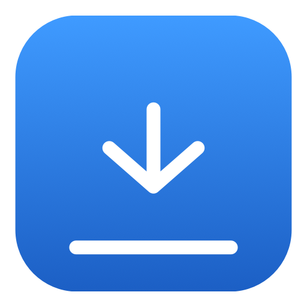
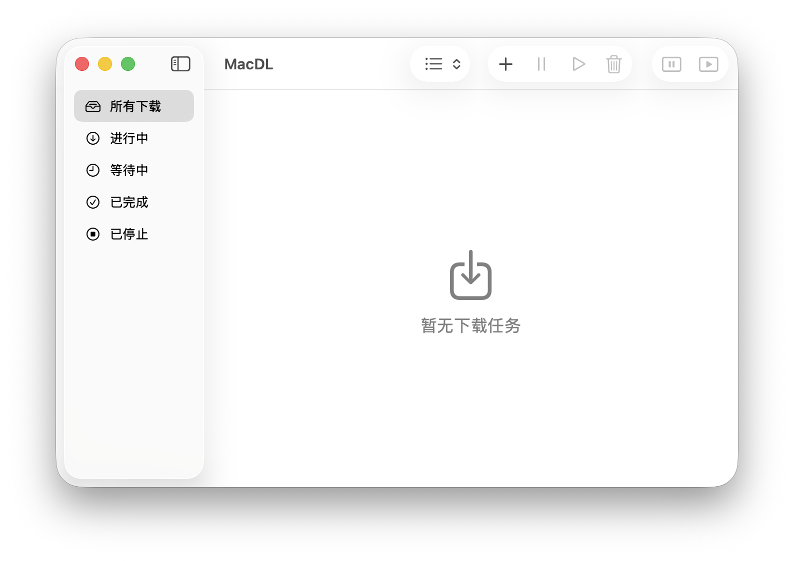

<div align="center">



# MacDL

[English](README.md)

[](LICENSE)
[]()
[]()
[]()
[]()
[](https://github.com/mwx280/MacDL/actions/workflows/ci.yml)
[](https://github.com/mwx280/MacDL/releases)
[]()

</div>

一个常驻 macOS 菜单栏的下载管理器。底层是建立在 `URLSession` 之上的多线程分块下载引擎，下载快，平时就安静待在菜单栏里，不碍事。



## 功能特性

- **常驻菜单栏**：关闭主窗口后程序照常运行，下载不中断；也可以设置在关窗时隐藏 Dock 图标。
- **多线程分块下载**：单个下载最多开 16 条并行连接；所有分块共用同一个 `URLSession`，HTTP/2 下能复用一条连接。分块大小根据文件大小、延迟和实测速率动态选择。默认的「自适应」连接模式会根据文件大小选择起始连接数，并按实测速度自适应——只有新增连接确实让传输更快时才保留，最终收敛到最优连接数（类似 IDM），同时复用同一主机以往会话的历史统计来加速冷启动。
- **多源 / 镜像下载**：一个下载可以同时使用多个镜像，按各源实测吞吐量加权调度分块；某个源出问题时进入冷却，其分块自动切换到健康源继续。
- **Metalink**：`.metalink` / `.meta4` 链接会被拉取并解析成多个镜像 URL 加 SHA-256 校验和，一个链接即可同时搞定镜像和校验。
- **校验和校验**：带 SHA-256 期望值的下载，完成后会先校验再改名；校验不一致的文件会被丢弃并标记为失败。
- **FTP 下载**：`ftp://` 链接按整文件单线程下载（FTP 不支持 Range）。
- **自动检测断点续传**：开始前先发一个 `Range` 探测请求，拿到真实文件大小，同时确认服务器是否返回 `206`；不支持 Range 的服务器会自动退回单线程下载。
- **暂停 / 续传**：下载过程中先写进 `.macdl` 暂存文件，全部完成后改成正式文件名。续传时用有界的 `Range` 请求头，已下载的字节不会重复拉取，断点状态重启后依然有效。
- **服务器变化保护**：下载途中如果服务器上的文件大小变了，会直接中止，不会拼出一份损坏文件。
- **限速**：按字节计量的令牌桶，单个任务和全局默认都可以限速。
- **优先下载**：把一个任务置为优先，其它任务自动暂停，优先结束后自动恢复；这个状态重启后也保留。
- **从剪贴板下载**：菜单栏一键提取剪贴板里的链接；遇到重复链接会问是否重新下载。
- **Finder 下载进度**：正在下载的任务会在 Dock 和 Finder 里显示实时进度。
- **系统通知**：开始 / 完成 / 失败可分别开关，失败通知带「重新下载」按钮。
- **自动更新**：检查 GitHub Releases，可一键下载并安装新版 DMG（安装始终需要手动点击，不会自动执行）。
- **中英双语界面**：支持英文和简体中文，运行时可随时切换。
- **沙盒化**：开启了 App Sandbox，自定义下载目录靠安全作用域书签访问。

## 架构

项目分两层：

1. **`MacDLCore`**：独立的 Swift Package，不依赖 AppKit。下载引擎就在这里——分块调度、限速、重试、续传都由它负责。
2. **`MacDL`**：应用本体。SwiftUI 界面、业务逻辑、持久化、通知、更新和沙盒处理。

应用通过 `DownloadEngineProtocol` 协议驱动引擎，测试时可以换成假引擎，完全不用碰网络和磁盘。

### 引擎（`MacDLCore/Sources/MacDLCore`）

| 文件 | 职责 |
|------|------|
| `DownloadEngine.swift` | 门面。每个下载对应一个 `ChunkManager`，所有控制调用统一走一条串行队列。 |
| `DownloadEngineProtocol.swift` | 协议边界，方便测试注入替身。 |
| `ChunkManager.swift` | 协调单个下载：Range 探测、动态分块、多源调度、指数退避重试、故障转移、不支持 Range 时退回单线程。 |
| `AutoConnectionPolicy.swift` | 纯自适应连接决策：冷启动连接数、跳步探测、限速冻结与收敛。 |
| `ChunkingPolicy.swift` | 根据文件大小、RTT 和单连速率选择分块大小的纯函数。 |
| `ChunkDownloadTask.swift` | 一条 Range 请求。用 `NSCondition` 事件驱动写入（不轮询），带缓冲上限和背压保护。 |
| `ChunkSessionDelegate.swift` | 把 `URLSession` 的回调分发给对应的分块任务。 |
| `TokenBucket.swift` | 同一下载内所有分块共用的限速桶，外加全局聚合带宽桶。 |
| `Chunk.swift` | 一个字节区间及其进度；可 `Codable`，重启后状态能恢复。 |
| `Source.swift` | 一个远端源（主源或镜像），带冷却状态和吞吐量 EWMA。 |
| `SourceScheduler.swift` | 在健康源之间做平滑加权轮询调度。 |
| `SourceHistoryStore.swift` | 按主机持久化下载历史（带宽/RTT），跨会话复用。 |
| `ChecksumVerifier.swift` | 流式 SHA-256，校验完成后文件是否匹配期望校验和。 |
| `MetalinkParser.swift` | 解析 Metalink（RFC 5854 / v4）文档，得到镜像 URL 加校验和。 |
| `EngineConstants.swift` | 集中管理引擎的调优参数：超时、缓冲大小、重试退避、上报节奏。 |
| `DownloadError.swift` | 引擎抛给上层应用的错误：`cancelled`、`fileDeleted`、`rangeNotSatisfiable`、`fileChanged`、`httpStatus`、`network`。 |
| `EngineLog.swift` | 用 `os.Logger` 分类记日志，同时镜像写进容器内的日志文件。 |

**一次下载是怎么跑的**

1. 先发一个带 `Range: bytes=0-262143` 的探测请求，从响应头 `Content-Range` 拿到文件总大小，并确认服务器是否返回 `206`。
2. 文件按动态大小切块（128 KB – 4 MB，由文件大小、延迟和实测速率决定），按 `maxConcurrent` 上限调度并行下载，并依据各源吞吐量加权分配。
3. 失败的分块按指数退避重试（1 秒、2 秒、4 秒……封顶 10 秒，最多 3 次）；`429`、`5xx`、网络错误会重试，永久性错误不重试。遇到 `429` 会立即下调连接数，持续限速的服务器会按指数退避重新探测。
4. 如果服务器忽略 Range（直接返回 `200`），引擎退回整文件单线程下载，失败后快速重试一次。

引擎里所有可变状态都锁在一条串行队列上，回调也回到这条队列，任何状态都不会被两个线程同时读写。

### 应用层（`MacDL`）

应用围绕 `@Observable` 状态对象组织：

```
ContentView ──────────────► ContentViewModel ─────► DownloadService ──► DownloadStore
      │                            (视图状态)           (业务逻辑)         (列表 + 持久化)
      │                                                    │
      │               DownloadEngineCoordinator（引擎胶水、Finder 徽章、沙盒）
      │               PriorityDownloadCoordinator（优先下载状态机）
      └── DownloadListView / DownloadRow / NewDownloadView / SettingsView
```

| 文件 | 职责 |
|------|------|
| `App/MacDLApp.swift` | 程序入口。SwiftUI App、菜单栏图标、设置窗口、单实例限制、退出前确认有下载任务。 |
| `App/MenuBarContent.swift` | 菜单栏操作：从剪贴板下载、显示/隐藏窗口、关于、偏好设置、退出。 |
| `Features/Content/ContentViewModel.swift` | 面向 SwiftUI 的视图状态（选中项、过滤器），实际操作转发给 `DownloadService`。 |
| `Features/Content/DownloadService.swift` | 下载生命周期：添加/暂停/续传/重试/重新下载/删除、等待队列、引擎完成后的处理、文件完整性检查。 |
| `Features/Content/DownloadStore.swift` | 下载列表的唯一数据源，负责读写持久化。 |
| `Features/Content/DownloadEngineCoordinator.swift` | 注册引擎回调、控制进度保存频率、把错误映射成中文/英文文案。 |
| `Features/Content/PriorityDownloadCoordinator.swift` | 优先下载的状态机：置顶、自动暂停其它任务、结束后的恢复。 |
| `Features/Content/ProgressPublisher.swift` | 发布和更新 Finder 的 `NSProgress` 进度，并接管取消操作。 |
| `Models/Download.swift` | 下载模型；持久化用紧凑格式（合并的已完成区间 + 各分块续传点）。 |
| `Models/DownloadPath.swift` | 统一决定 `.macdl` 暂存文件和最终文件的路径，避免各处写死。 |
| `Models/AppConfig.swift` | 在沙盒下解析真实的用户「下载」目录。 |
| `Services/DownloadPersistence.swift` | 把下载列表存成 JSON 放到 Application Support，后台写入，兼容旧数据。 |
| `Services/DownloadNotifier.swift` | 系统通知和「重新下载」操作按钮。 |
| `Services/SettingsStore.swift` | 基于 `UserDefaults` 的设置。 |
| `Services/SandboxAccess.swift` | 对用户手动选择的目录做安全作用域访问。 |
| `Services/LanguageManager.swift` | 运行时切换语言（跟随系统 / 英文 / 简体中文）。 |
| `Services/UpdateService.swift`、`UpdateModel.swift` | GitHub Releases 自动更新：检查、下载 DMG、安装并重启。 |
| `Services/LaunchAtLoginService.swift` | 通过 `SMAppService` 实现开机自启。 |
| `Services/DockIconManager.swift` | 根据窗口开关隐藏/恢复 Dock 图标。 |
| `Features/Settings/*` | 设置面板：通用、下载、更新、通知。 |
| `Features/Content/NewDownloadView.swift`、`NewDownloadModel.swift` | 新建下载面板：粘贴/拖入链接、每个任务独立设置线程数和限速、探测是否支持续传。 |

**下载生命周期**

```
添加 → 探测（状态为「下载中」，界面显示 Preparing）→ 分块调度
     → 完成 → 把 .macdl 改成正式文件名 → 发通知
     → 暂停 → 状态变为已暂停 → 续传（不重复拉已下载的字节）
     → 失败 → 状态变为错误 → 重试 / 重新下载 / 删除
```

单个下载和全局都设了并发上限，超出上限的任务进等待队列；某个任务结束后，会自动开始下一个等待中的下载。

**持久化**

分块进度不存全量分块数组，而是存合并后的连续已完成区间，以及各个分块的续传偏移。这样一份 100 GB 的文件下载完，落盘也只有几个区间条目，而不是约 40 万个分块。进度每 5 秒保存一次，退出时立即落盘。

## 系统要求与构建

- macOS 15 及以上。
- 装有 macOS 15 SDK 或更高版本的 Xcode。
- 没有任何外部依赖。

```sh
# 打开并在 Xcode 中运行
open MacDL.xcodeproj
# scheme 选 MacDL

# 引擎包测试
cd MacDLCore && swift test

# 应用测试
xcodebuild test -project MacDL.xcodeproj -scheme MacDL -destination 'platform=macOS'
```

## 目录结构

```
MacDL.xcodeproj        Xcode 工程（应用 + 应用测试）
MacDL/                 应用目标
  App/                 程序入口、菜单栏、关于窗口
  Features/Content/    下载界面、视图模型、服务、协调器
  Features/Settings/   设置面板
  Models/              下载模型、路径、格式化、过滤器
  Components/          通用 SwiftUI 组件
  Services/            持久化、通知、更新、沙盒、语言
  Resources/           Localizable.xcstrings、资源目录
MacDLCore/             引擎 Swift Package
  Sources/MacDLCore/   引擎实现
  Tests/               引擎测试（Swift Testing + 假 URLProtocol）
MacDLTests/            应用测试（XCTest + 假引擎）
.github/workflows/     CI：引擎测试 + 应用构建 + 应用测试
```

## 测试

一共 265 个测试，分两套：

- **引擎（97 个）**：Swift Testing + 假 `URLProtocol`，不发真实网络请求。覆盖分块完整性、暂停/续传、限速、退避、单线程回退、Range 边界、多源故障转移、动态分块、校验和、Metalink 解析、源调度和 FTP。
- **应用（168 个）**：XCTest + 假引擎，不碰真实磁盘和通知中心。覆盖下载生命周期、优先流程、重复下载策略、持久化往返、Metalink 失败处理、更新状态机和本地化。

CI（GitHub Actions）先跑引擎测试，再构建并测试应用。

## 本地化

界面文案统一放在 `MacDL/Resources/Localizable.xcstrings`（英文为源语言，附简体中文翻译）。`LanguageManager` 决定用哪种语言（跟随系统或手动指定），切换后界面立刻刷新。错误信息持久化存的是文案的 key，所以换语言后也能正确显示。

## 许可证

[GPL-3.0](LICENSE)

**明确限制：**

- 个人使用、学习、修改、fork 完全自由
- 将修改后的版本以 GPL-3.0 协议开源发布，完全自由
- 将本项目的任何部分（包括 `MacDLCore` 引擎）以闭源形式集成进任何商业软件并分发，严格禁止
- 将本项目的代码或修改版作为闭源产品对外销售，严格禁止

违反上述条款的行为将被视为侵犯著作权，作者保留追究法律责任的权利。
